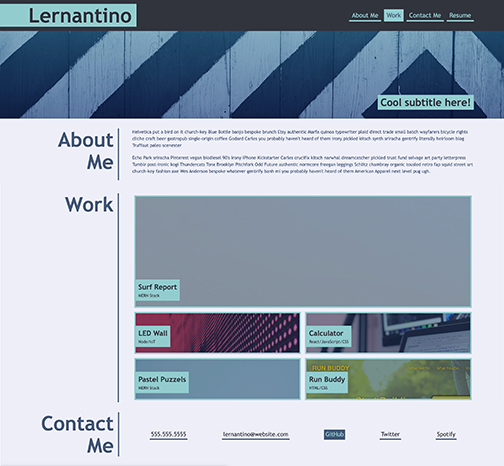

# Work Portfolio

UCLA Bootcamp Challenge 2 - Module 2

Due Date 8/25/2022

## Challenge Tasks
---

Create application showcasing your skills and talents for potentional employers
- Portfolio of deployed web applications
- Showcase your strongest work and thought process behind it. 
- Contact information

Final application to resemble the following mock-up:

## Requirements
---

- Header with Name, photo or avatar
- Navigation bar with working links to sections (about me, contact, work)
- Work link to navigate to section with images of each built application
- First application to be larger than others
- Application sections should be working links that navigate to corresponding deployed websites
- Responsive layout adapted to viewports
- Heading attributes to fall in sequential order
- HTML elements & CSS selectors follow logical structure
- Accessible alt attributes for all images
- Follow best practice for file structure, naming indentations and comments
- Create GitHub repository with multilpe commits and descriptive messages
- README file with screenshots and link to final deployed applicaton and GitHub repository
- Deploy application with no errors while loading

## Final Submission
---
1. Portfolio application is deployed and can be seen at: [Potfolio](https://me-ross.github.io/)

2. Repository for Portfolio can be found at: [GitHub](https://github.com/Me-ross/)

